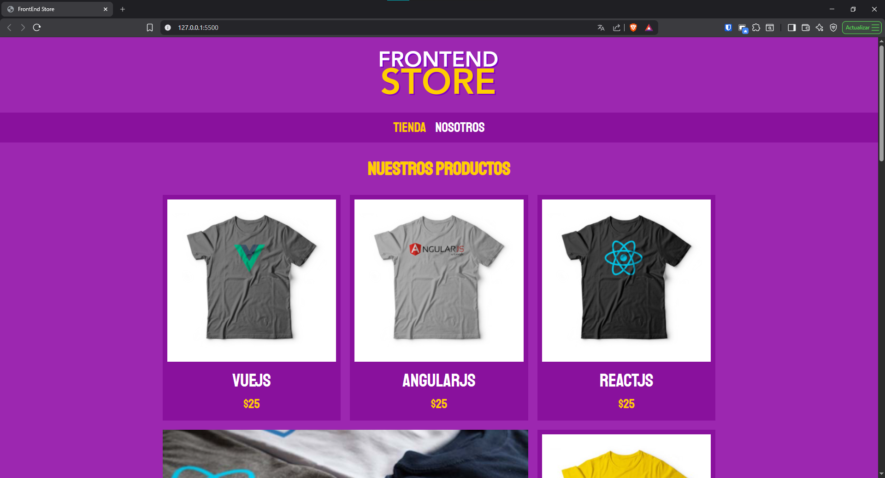

# Frontend Store

E-commerce frontend desarrollado como parte del curso "Desarrollo Web Completo". El proyecto implementa una tienda virtual enfocada en la venta de camisetas, aplicando principios de diseño responsive y buenas prácticas de maquetación web.

## 🚀 Demo

Próximamente disponible en GitHub Pages.

## 📸 Captura del proyecto

## 🛠️ Tecnologías utilizadas

- HTML5
- CSS3
- CSS Grid
- Flexbox
- CSS Variables
- Responsive Web Design

## ✨ Funcionalidades

- Catálogo de productos.
- Página de detalle de producto.
- Página "Nosotros".
- Diseño responsive.
- Uso de CSS Grid para la distribución de productos.

## 🎯 Objetivos de aprendizaje

- Maquetación semántica.
- Diseño responsive.
- Organización de proyectos frontend.
- Aplicación de CSS Grid y Flexbox.

## 👨‍💻 Autor

**Cristhian Chanamé**
Estudiante de Ingeniería de Software